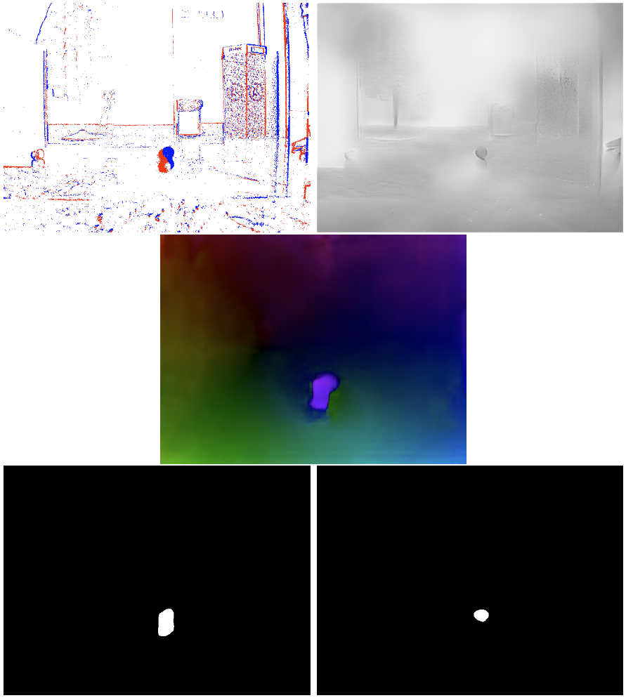

# TFM: Detección de objetos que se mueven de forma independiente (IMOs) con sensores de eventos
## Resumen
<p style="text-align: justify; text-justify: inter-word;">
La detección de objetos que se mueven independientemente es un campo de interes por su aplicación en tareas como navegación. Por otra parte, está en auge ya que se están introduciendo nuevos sensores como son los sensores neuromórficos (o cámaras de eventos) que son de especial interés cuando se habla de alto rango dinámico y velocidad en la escena (fps). En paralelo se están desarrollando a su vez métodos tanto matemáticos como los métodos más novedosos que son el aprendizaje profundo, que son capaces de explotar estos nuevos sensores. Esto hace que a día de hoy sea un campo realmente grande pero que está en continuo avance. En este trabajo se va a realizar un repaso del estado del arte de los métodos más actuales y/o de mayor importancia, así como los conjuntos de datos que se utilizan para probar los diferentes métodos. Además se presenta un sistema creado a partir de los métodos del estado del arte y se propone un nuevo conjunto de datos para detección de objetos que se mueven independientemente en navegación. Por último se discuten tanto los resultados obtenidos por medio de las métricas que se utilizan para estos métodos como por qué no utilizar los conjuntos de datos que ya existen.
</p>

<p align="center">
 
</p>

## Prerequisitos

Crear un entorno con Anaconda para exportar las librerias necesarias para el funcionamiento de todos los códigos disponibles aquí.

```bash
conda create --name <env> --file requisitos.txt
```

Las librerías más relevantes son:

- **python**: versión **_python=3.10.10_**.
- **pytorch-cuda**: versión **_pytorch=1.12.1=py3.10_cuda11.3_cudnn8_0_**
- **cudatoolkit**: versión **_cudatoolkit=11.3.1_**

Cada método está preparado para ser utilizado con el conjunto de datos E-NAVI. Los métodos E-RAFT y MultiCM están preparados para poder utilizar su antigua configuración, E2VID solo soporta E-NAVI, y MATNet solo soporta la estructura indicada en el propio método.

## E-RAFT

En E-RAFT se ha añadido/modificado:
- "__config/enavi_standard.json__": para la configuración del conjunto de datos E-NAVI.
- "__loader/loader_enavi.py__": para cargar el conjunto de datos E-NAVI.
- "__utils/visualization.py__": se ha añadido una clase nueva llamada "__EnaviVisualizerEvents__" para la visualización de los eventos para el conjunto de datos E-NAVI.


### E-RAFT preentrenado

Descargar desde [aquí](https://download.ifi.uzh.ch/rpg/ERAFT/checkpoints/dsec.tar) la red preentrenada en la carpeta ```checkpoints/```.


<!-- ### Argumentos

```--path``` : Ruta donde se encuentra el conjunto de datos

```--dataset``` : Qué conjunto de datos se va a usar: ([e-navi]/dsec/mvsec)

```--type``` : Evaluation type ([standard]/warm_start)

```--frequency``` : Evaluation frequency of MVSEC dataset ([20]/45) Hz

```--visualize``` : Provide this argument s.t. DSEC results are visualized. E-NAVI results are always visualized. MVSEC experiments are always visualized.

```--num_workers``` : How many sub-processes to use for data loading (default=0) -->


### Ejecutar E-RAFT

```bash
cd E-RAFT
python3 main_tfm.py --path <ruta del conjunto de datos>
```
__NOTA__: La salida se guardará en ```saved/enavi_standard*/visualizations/```. Solo se puede modificar la carpeta ```saved/``` por otra dentro del archivo de configuración "__config/enavi_standard.json__" en el parámetro **_save_dir_**. La estructura de carpetas de la salida seguirá siendo la misma.

## MultiCM

En MultiCM se han añadido/modificado:
- "__main_sequence.py__": añadido ya que MultiCM está preparado para _MVSEC_ y el código solo estimaba un fotograma. Se ha cambiado el código principal para poder evaluar una secuencia entera. 
- "__src/data_loader/enavi.py__" para poder cargar el conjunto de datos E-NAVI. 
- "__src/visualizer.py__": modificado para que la salida de las imágenes esté estructurada en diferentes carpetas.
- "__configs/enavi.yaml__": añadido con la configuración del conjunto de datos E-NAVI.

### Ejecutar MultiCM

__NOTA__: Dentro del archivo de configuración "__configs/enavi.yaml__", hay que modificar varios parámetros:
- **_root_**: la ruta del conjunto de datos. 
- **_sequence_**: por cada secuencia poner el nombre de la secuencia a utilizar.
- **_output_dir_**: por cada secuencia poner la ruta de salida.

__NOTA2__: En MultiCM hay que ejecutar la orden siguiente junto con la modificación del archivo de configuración comentado, por cada secuencia que se quiera utilizar. Esto es así ya que __tarda de media 72 segundos por fotograma__.

```bash
cd MultiCM
python3 main_sequence.py --config_file ./configs/enavi.yaml
```

## E2VID

En E2VID se han modificado:
- "__utils/timers.py__": para permitir que muestre el mínimo y el máximo de tiempo en inferencia.
- "__utils/event_reader.py__": para poder cargar el conjunto de datos E-NAVI.
- "__image_reconstructor.py__" y "__utils/inference_utils.py__": modificados para cambiar el nombre de las imágenes de salida.
- "__run_reconstruction.py__": modificado para iterar sobre el conjunto de datos E-NAVI.

### E2VID preentrenado

Para descargar la red preentrenada:

```bash
wget "http://rpg.ifi.uzh.ch/data/E2VID/models/E2VID_lightweight.pth.tar" -O pretrained/E2VID_lightweight.pth.tar
```

### Ejecutar E2VID

En E2VID se puede utilizar *--window_duration* junto con la duración de la ventana de tiempo en milisegundos para usar más o menos eventos a la hora de generar las imágenes.

```bash
cd E2VID
python3 run_reconstruction.py /
-c <ruta del modelo E2VID preentrenado> /
-i <ruta a una secuencia del conjunto de datos E-NAVI> /
--fixed_duration /
--window_duration <con 10 genera bien para casi todas las secuencias> /
--output_folder <ruta al directorio de salida> /
--dataset_name <nombre de la carpeta de salida>
```

## MATNet

En MATNet se han añadido/modificado:
- "__test_MATNet_tfm.py__": para cargar el conjunto de datos completo y generar la segmentación sin binarizar. Además crea para cada secuencia un archivo con los tiempos de inferencia de cada fotograma llamado "*inference_time.txt*".
- "__test_iou.py__": binariza y genera un csv con los resultados de IOU y una gráfica en formato SVG.

### MATNet preentrenado

El modelo preentrenado se debe descargar desde [Google Drive](https://drive.google.com/file/d/1XlenYXgQjoThgRUbffCUEADS6kE4lvV_/view?usp=sharing). Se deberán descomprimir los dos modelos ".pt" y añadir a la ruta ```ckpt/matnet/<archivos.pt>```.

### Ejecutar MATNet

Para ejecutar MATNet se debe tener una estructura con los resultados de flujo óptico de la siguiente manera:
    
    Estructura de carpetas:

    <nombre de carpeta para entrada de matnet>
    └── <nombre de la secuencia>
        ├── flow/
        │   ├── 0.png
        │   ├── 1.png
        │   └── ...
        ├── gt/ "solo estarán los fotogramas en los que haya ground truth"
        │   ├── 14.png
        │   ├── 20.png
        │   └── ...
        ├── 0.png
        ├── 1.png
        └── ...

A tener en cuenta:
- Cada número de imágen corresponde al fotograma o índice generado por cada método.
- La raíz de cada secuencia estará dedicada a las imágenes de eventos, la carpeta ```flow/``` a las imágenes de flujo óptico y la carpeta ```gt/``` a las imágenes ground truth generadas para esa secuencia concreta.
- La carpeta ```gt/``` se deberá de crear a mano para cada secuencia en la que se haya generado el ground truth, guardando cada imagen con número de fotograma o índice en el que se haya realizado.

Para cada método:
- __E-RAFT__ genera esta estructura, menos la carpeta ```gt/``` que se deberá de hacer a mano.
- __MultiCM__ __NO__ genera esta estructura, aunque si cada carpeta que son ```events/``` con los eventos, y dentro de ```flow/``` se divide en ```dense/``` donde estarán las imágenes de flujo óptico denso que serán las que se utilicen para MATNet, y ```sparse/``` donde se encuentran las imágenes de flujo óptico disperso.

Si se quiere ejecutar MATNet utilizando E2VID se tendrán que asociar los fotogramas obtenidos por E2VID a los del flujo óptico a utilizar junto con el índice concreto.

Por tanto antes de ejecutar la segmentación se deberá de crear una carpeta con la estructura indicada anteriormente con todas las secuencias que se deseen segmentar. 

__NOTA IMPORTANTE__: **Si solo se quiere estimar directamente MATNet sin necesidad de generar los eventos, el flujo óptico y las imágenes de intensidad reconstruidas por E2VID**. Se proporciona toda la estructura junto con la carpeta ```gt/``` en la carpeta ```test_matnet/```, además dispone de la secuencia "**_pelota_chica_robot_movimiento_eraft_100000_img_**" que contiene imágenes de intensidad generadas por E2VID.


Con esto se podrá pasar a ejecutar MATNet:

1. Ejecutar MATNet para generar la segmentación:

```bash
cd MATNet
python3 test_MATNet_tfm.py /
--input_dir <ruta a la estructura de carpetas con los resultados de flujo óptico obtenidos por los métodos> /
--output_dir <ruta a la carpeta donde se guardarán los resultados>
```

2. Ejecutar MATNet para obtener los resultados:

```bash
cd MATNet
python3 test_MATNet_tfm.py --input_dir <ruta a la carpeta con los resultados de segmentación> --output_dir <ruta al ground truth del conjunto de datos E-NAVI>
```

# Citas
## E-RAFT
```bibtex
@InProceedings{Gehrig3dv2021,
  author = {Mathias Gehrig and Mario Millh\"ausler and Daniel Gehrig and Davide Scaramuzza},
  title = {E-RAFT: Dense Optical Flow from Event Cameras},
  booktitle = {International Conference on 3D Vision (3DV)},
  year = {2021}
}
```
## MultiCM
```bibtex
@InProceedings{Shiba22eccv,
  author        = {Shintaro Shiba and Yoshimitsu Aoki and Guillermo Gallego},
  title         = {Secrets of Event-based Optical Flow},
  booktitle     = {European Conference on Computer Vision (ECCV)},
  pages         = {628--645},
  doi           = {10.1007/978-3-031-19797-0_36},
  year          = 2022
}
```
## E2VID
```bibtex
@Article{Rebecq19pami,
  author        = {Henri Rebecq and Ren{\'{e}} Ranftl and Vladlen Koltun and Davide Scaramuzza},
  title         = {High Speed and High Dynamic Range Video with an Event Camera},
  journal       = {{IEEE} Trans. Pattern Anal. Mach. Intell. (T-PAMI)},
  url           = {http://rpg.ifi.uzh.ch/docs/TPAMI19_Rebecq.pdf},
  year          = 2019
}

@Article{Rebecq19cvpr,
  author        = {Henri Rebecq and Ren{\'{e}} Ranftl and Vladlen Koltun and Davide Scaramuzza},
  title         = {Events-to-Video: Bringing Modern Computer Vision to Event Cameras},
  journal       = {{IEEE} Conf. Comput. Vis. Pattern Recog. (CVPR)},
  year          = 2019
}
```
## MATNet
```bibtex
@inproceedings{zhou2020motion,
  title={Motion-Attentive Transition for Zero-Shot Video Object Segmentation},
  author={Zhou, Tianfei and Wang, Shunzhou and Zhou, Yi and Yao, Yazhou and Li, Jianwu and Shao, Ling},
  booktitle={Proceedings of the 34th AAAI Conference on Artificial Intelligence (AAAI)},
  year={2020},
  pages={13066--13073}
}

@article{zhou2020matnet,
  title={MATNet: Motion-Attentive Transition Network for Zero-Shot Video Object Segmentation},
  author={Zhou, Tianfei and Li, Jianwu and Wang, Shunzhou and Tao, Ran and Shen, Jianbing},
  journal={IEEE Transactions on Image Processing},
  volume={29},
  pages={8326-8338},
  year={2020}
}

@inproceedings{zhou2021unsupervised,
  author = {Zhou, Tianfei and Li, Jianwu and Li, Xueyi and Shao, Ling},
  title = {Target-Aware Object Discovery and Association for Unsupervised Video Multi-Object Segmentation},
  booktitle = {CVPR},
  year = {2021}
}
```